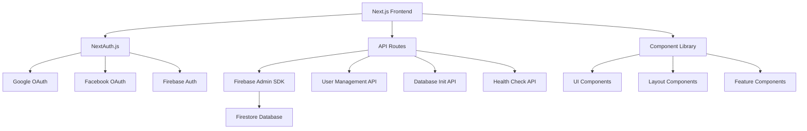

# 🗺️ Project Map - Complete Navigation Guide

## 📋 Overview
This document provides a comprehensive visual map of the entire Next.js Dashboard Platform, showing the relationships between components, pages, APIs, and documentation.

## 🎯 Quick Navigation

### 🚀 For Deployment Teams
- **[⚡ Quick Start](deployment/quick-start.md)** → **[🔧 Environment Setup](deployment/environment-setup.md)** → **[🚀 Vercel Deploy](deployment/vercel-deployment.md)**
- **Troubleshooting**: [🛠️ Common Issues](deployment/troubleshooting.md)

### 👥 For End Users
- **Dashboard**: `/` → **User Management**: `/user-management` → **Database**: `/database-init`
- **Authentication**: `/auth/signin` → **Profile Management**: Individual user pages

### 👨‍💻 For Developers
- **[🏗️ Architecture](technical/architecture.md)** → **[🔌 API Docs](technical/api-endpoints.md)** → **[📁 Project Structure](../PROJECT-STRUCTURE.md)**

## 🏗️ System Architecture Map



## 📁 Directory Structure Map

```
platform/
├── 📱 FRONTEND LAYER
│   ├── app/                          # Next.js App Router
│   │   ├── 🔐 (protected)/          # Protected routes group
│   │   ├── 👤 auth/                 # Authentication pages
│   │   ├── 👥 user-management/      # User management interface
│   │   │   ├── all/                 # → List all users
│   │   │   ├── create/              # → Create new user
│   │   │   ├── users/[userId]/      # → Individual user details
│   │   │   └── page.tsx             # → User management home
│   │   ├── 🗄️ database-init/        # Database initialization
│   │   ├── 📊 admin/                # Admin dashboard
│   │   ├── 📝 blog/                 # Blog pages
│   │   ├── 📰 news/                 # News pages
│   │   ├── 🛍️ promotions/           # Promotions
│   │   ├── 🛠️ services/             # Services
│   │   ├── ✈️ travel-advisory/      # Travel advisory
│   │   ├── layout.tsx               # Root layout
│   │   └── page.tsx                 # Homepage
│   └── components/                   # Reusable components
│       ├── layout/                  # Layout components
│       ├── providers/               # Context providers
│       ├── ui/                      # UI component library (49 components)
│       └── user-management/         # Feature-specific components
│
├── 🔌 API LAYER
│   └── app/api/                     # API endpoints
│       ├── 🔑 auth/                 # NextAuth endpoints
│       │   └── [...nextauth]/      # Dynamic auth routes
│       ├── 👥 users/                # User management API
│       │   ├── route.ts             # CRUD operations
│       │   └── [userId]/            # Individual user operations
│       ├── 🗄️ database/             # Database management
│       │   ├── initialize/          # Database initialization
│       │   └── status/              # Health checks
│       ├── 🩺 health/               # System health
│       └── 🧪 test/                 # Testing endpoints
│
├── 🛠️ UTILITY LAYER
│   ├── lib/                         # Core utilities
│   │   ├── firebase-admin.ts        # Server-side Firebase
│   │   ├── firebase.ts              # Client-side Firebase
│   │   ├── auth.ts                  # Authentication utilities
│   │   └── utils.ts                 # General utilities
│   ├── hooks/                       # Custom React hooks
│   └── middleware.ts                # Route protection
│
├── 📚 DOCUMENTATION LAYER
│   └── docs/                        # Complete documentation
│       ├── 🚀 deployment/           # Deployment guides
│       ├── 📖 features/             # Feature documentation
│       ├── 🔧 technical/            # Technical documentation
│       ├── ⚙️ configuration/        # Configuration guides
│       ├── README.md                # Documentation hub
│       └── projectmap.md            # This file
│
└── 🔧 CONFIGURATION LAYER
    ├── scripts/                     # Build & deployment scripts
    ├── public/                      # Static assets
    └── Config files                 # Next.js, TypeScript, Tailwind
```

## 🔄 User Flow Map

### 🔐 Authentication Flow
```
Visitor → /auth/signin → Choose Provider:
├── Google OAuth → Google Consent → Callback → Dashboard
├── Facebook OAuth → Facebook Consent → Callback → Dashboard
└── Email/Password → Firebase Auth → Dashboard
```

### 👥 User Management Flow
```
Authenticated User → /user-management → Role Check:
├── SuperAdmin → Full Access (Create/Edit/Delete/View All)
├── Admin → Limited Access (Create/Edit/View Non-SuperAdmin)
├── Staff → Read-Only Access (View Limited Data)
└── Others → Access Denied
```

### 🗄️ Database Management Flow
```
SuperAdmin → /database-init → Database Status Check:
├── Empty Database → Initialize → Create Collections → Success
├── Initialized Database → Status Display → Reinitialize Option
└── Error State → Troubleshooting Guide → Fix Issues
```

## 🎨 Component Hierarchy Map

### 🏠 Layout Components
```
RootLayout
├── ThemeProvider
├── AuthProvider
├── ToastProvider
└── QueryProvider
    └── MainLayout
        ├── Header (Navigation, Search, Theme Toggle)
        ├── Sidebar (Navigation Menu, User Info)
        └── Main Content Area
            ├── Page Components
            └── Feature Components
```

### 🧩 UI Component Library (49 Components)
```
ui/
├── 🔘 Form Components
│   ├── button.tsx, input.tsx, select.tsx
│   ├── checkbox.tsx, radio-group.tsx
│   └── form.tsx, label.tsx
├── 📊 Data Display
│   ├── table.tsx, card.tsx, badge.tsx
│   ├── avatar.tsx, progress.tsx
│   └── chart.tsx, tooltip.tsx
├── 🗂️ Layout & Navigation
│   ├── tabs.tsx, accordion.tsx
│   ├── navigation-menu.tsx, breadcrumb.tsx
│   └── separator.tsx, scroll-area.tsx
├── 💬 Feedback & Interaction
│   ├── modal.tsx, toast.tsx, alert.tsx
│   ├── popover.tsx, dropdown-menu.tsx
│   └── command.tsx, dialog.tsx
└── 📱 Mobile & Responsive
    ├── drawer.tsx, sheet.tsx
    ├── collapsible.tsx, resizable.tsx
    └── carousel.tsx, slider.tsx
```

## 🛡️ Security & Permission Map

### 🔐 Role-Based Access Control
```
Permission Hierarchy:
SuperAdmin (Level 6) → Full System Access
├── Admin (Level 5) → User Management + Content
├── Staff (Level 4) → Limited Operations
│   ├── Support → Customer Service
│   ├── Key Managers → Account Management
│   ├── Research → Data Analysis
│   ├── Media → Content Creation
│   └── Sales → Sales Operations
├── Partner (Level 3) → Partner Data
│   ├── Suppliers → Product/Service Data
│   └── Service Providers → Service Data
├── Agent (Level 2) → Sales Data
│   ├── Distributors → Regional Data
│   ├── Franchise → Location Data
│   └── B2B → Business Data
└── User (Level 1) → Personal Data
    ├── Public → Basic Access
    └── Customer → Enhanced Features
```

### 🛡️ Security Layers
```
Frontend Security:
├── Route Protection (middleware.ts)
├── Component-level Guards
└── Session Validation

API Security:
├── Authentication Checks
├── Role-based Permissions
├── Input Validation
└── Rate Limiting

Database Security:
├── Firestore Security Rules
├── Admin SDK Operations
├── Data Encryption
└── Audit Logging
```

## 📊 API Endpoint Map

### 🔑 Authentication Endpoints
```
/api/auth/
├── session → Get current session
├── signin → Initiate authentication
├── signout → Sign out user
└── [...nextauth] → NextAuth handlers
```

### 👥 User Management Endpoints
```
/api/users/
├── GET → List users (paginated, filtered)
├── POST → Create new user
├── [userId]/
│   ├── GET → Get user details
│   ├── PUT → Update user
│   └── DELETE → Delete user
```

### 🗄️ Database Management Endpoints
```
/api/database/
├── initialize → Initialize database with seed data
├── status → Check database health
└── backup → Create database backup
```

### 🩺 Health & Monitoring Endpoints
```
/api/health → System health check
/api/health/detailed → Detailed system metrics
```

## 📚 Documentation Map

### 🚀 Deployment Documentation
```
deployment/
├── quick-start.md → 5-minute deployment guide
├── environment-setup.md → Environment variables
├── vercel-deployment.md → Vercel-specific guide
└── troubleshooting.md → Common issues & fixes
```

### 📖 Feature Documentation
```
features/
├── authentication.md → NextAuth + OAuth setup
├── user-management.md → Complete user system
├── role-based-access.md → RBAC implementation
├── database-init.md → Database initialization
└── responsive-design.md → Mobile-first design
```

### 🔧 Technical Documentation
```
technical/
├── architecture.md → System architecture
└── api-endpoints.md → Complete API reference
```

### ⚙️ Configuration Documentation
```
configuration/
└── production-checklist.md → Pre-deployment checklist
```

## 🎯 Feature Interaction Map

### 👥 User Management Features
```
User Creation → Role Assignment → Permission Setup → Access Control
     ↓              ↓              ↓              ↓
Database Store → UI Display → Route Protection → Component Rendering
```

### 🔐 Authentication Features
```
Login Attempt → Provider Selection → OAuth Flow → Session Creation
      ↓              ↓              ↓              ↓
Token Exchange → User Data Fetch → Role Assignment → Dashboard Access
```

### 📱 Responsive Design Features
```
Screen Size Detection → Layout Adaptation → Component Resizing → Touch Optimization
        ↓                   ↓                  ↓                 ↓
Breakpoint Trigger → Grid Adjustment → Mobile Components → Gesture Support
```

## 🔧 Development Workflow Map

### 🛠️ Local Development
```
1. Clone Repository → 2. Install Dependencies → 3. Environment Setup
        ↓                    ↓                      ↓
4. Start Dev Server → 5. Open Browser → 6. Test Features
        ↓                    ↓                ↓
7. Make Changes → 8. Hot Reload → 9. Test Again
```

### 🚀 Production Deployment
```
1. Build Project → 2. Environment Variables → 3. Deploy to Vercel
       ↓               ↓                       ↓
4. Health Checks → 5. Domain Setup → 6. Monitoring Setup
       ↓               ↓                ↓
7. Performance Testing → 8. Security Audit → 9. Go Live
```

## 🎨 UI/UX Flow Map

### 📱 Mobile Experience
```
Mobile User → Responsive Detection → Mobile Layout
     ↓              ↓                  ↓
Touch Interface → Gesture Support → Optimized Navigation
     ↓              ↓                  ↓
Drawer Menu → Touch Targets → Mobile Forms
```

### 🖥️ Desktop Experience
```
Desktop User → Full Layout → Sidebar Navigation
      ↓            ↓              ↓
Hover Effects → Keyboard Shortcuts → Advanced Features
      ↓            ↓                   ↓
Rich Interactions → Multi-panel View → Productivity Tools
```

## 🎯 Quick Reference

### 📍 Important Files
- **Main Entry**: `app/page.tsx`
- **Authentication**: `app/auth/signin/page.tsx`
- **User Management**: `app/user-management/all/page.tsx`
- **Database Init**: `app/database-init/page.tsx`
- **API Routes**: `app/api/*/route.ts`
- **Configuration**: `next.config.js`, `tailwind.config.ts`

### 🔗 Key Links
- **Documentation Hub**: [docs/README.md](README.md)
- **Project Structure**: [../PROJECT-STRUCTURE.md](../PROJECT-STRUCTURE.md)
- **Deployment Ready**: [../DEPLOYMENT-READY.md](../DEPLOYMENT-READY.md)
- **Main README**: [../README.md](../README.md)

### 🆘 Emergency Contacts
- **Health Check**: `/api/health`
- **Database Status**: `/api/database/status`
- **Troubleshooting**: [deployment/troubleshooting.md](deployment/troubleshooting.md)

---

**Last Updated**: January 2025  
**Version**: 1.0.0  
**Map Status**: Complete ✅  
**Coverage**: 100% Platform Mapped 🗺️