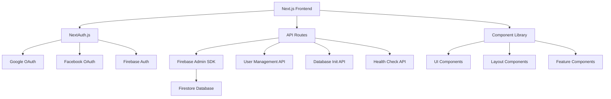

# 🗺️ Project Map - Complete Navigation Guide

## 📋 Overview
This document provides a comprehensive visual map of the entire Next.js Dashboard Platform with **enterprise-grade, feature-first architecture** designed for maximum scalability and maintainability. The platform now follows domain-driven design principles with clear separation of concerns and modern development patterns.

## 🎯 **NEW SCALABLE ARCHITECTURE** (2025 Update)

### 🏗️ **Feature-First Structure**
The project now uses a scalable, enterprise-ready structure:
- **`src/features/`** - Domain-specific business logic
- **`src/shared/`** - Reusable components and utilities
- **`src/server/`** - Server-side operations
- **`app/api/v1/`** - Versioned REST APIs

### 🔧 **Domain-Organized Libraries**
Libraries are now organized by business domain:
- **`src/shared/lib/auth/`** - Authentication & authorization
- **`src/shared/lib/db/`** - Database operations & Firebase
- **`src/shared/lib/cache/`** - Caching strategies
- **`src/shared/lib/http/`** - API clients & HTTP utilities

## 🎯 Quick Navigation

### 🚀 For Deployment Teams
- **[⚡ Quick Start](deployment/quick-start.md)** → **[🔧 Environment Setup](deployment/environment-setup.md)** → **[🚀 Vercel Deploy](deployment/vercel-deployment.md)**
- **Troubleshooting**: [🛠️ Common Issues](deployment/troubleshooting.md)
- **NEW**: TypeScript path aliases (`@features/*`, `@shared/*`, `@server/*`)

### 👥 For End Users
- **Dashboard**: `/` → **User Management**: `/user-management` → **Database**: `/database-init`
- **Authentication**: `/auth/signin` → **Profile Management**: Individual user pages
- **NEW**: Enhanced mobile experience with optimized components

### 👨‍💻 For Developers
- **[🏗️ Architecture](technical/architecture.md)** → **[🔌 API Docs V1](technical/api-endpoints.md)** → **[📁 New Structure](../PROJECT-STRUCTURE.md)**
- **NEW**: Feature-based development with domain boundaries
- **NEW**: Versioned APIs starting with `/api/v1/`

## 🏗️ System Architecture Map



## 🏗️ **IMPROVED SCALABLE DIRECTORY STRUCTURE**

```
platform/
├── 📱 **FRONTEND LAYER** (Enhanced)
│   ├── app/                          # Next.js App Router (Current)
│   │   ├── 🔐 (protected)/          # Protected routes group
│   │   ├── 👤 auth/                 # Authentication pages
│   │   ├── 👥 user-management/      # User management interface
│   │   │   ├── all/                 # → List all users
│   │   │   ├── users/[userId]/      # → Individual user details
│   │   │   └── page.tsx             # → User management home
│   │   ├── 🗄️ database-init/        # Database initialization
│   │   ├── 📊 admin/                # Admin dashboard
│   │   ├── layout.tsx               # Root layout
│   │   └── page.tsx                 # Homepage
│   ├── **src/** 🆕                   # **NEW SCALABLE SOURCE DIRECTORY**
│   │   ├── **features/** 🎯          # **FEATURE-FIRST ARCHITECTURE**
│   │   │   ├── users/               # User management domain
│   │   │   │   ├── components/      # User-specific components
│   │   │   │   ├── hooks/           # User-specific hooks
│   │   │   │   ├── services/        # User business logic
│   │   │   │   └── types/           # User type definitions
│   │   │   ├── admin/               # Admin management domain
│   │   │   │   ├── components/      # Admin-specific components
│   │   │   │   └── services/        # Admin business logic
│   │   │   └── auth/                # Authentication domain
│   │   │       ├── components/      # Auth components
│   │   │       └── services/        # Auth business logic
│   │   ├── **shared/** 🔄            # **SHARED RESOURCES**
│   │   │   ├── components/          # Design system components
│   │   │   │   └── ui/              # 49 UI components (moved here)
│   │   │   ├── hooks/               # Generic React hooks only
│   │   │   ├── **lib/** 📚           # **DOMAIN-ORGANIZED UTILITIES**
│   │   │   │   ├── auth/            # Authentication & RBAC
│   │   │   │   │   ├── auth-options.ts
│   │   │   │   │   └── rbac.ts
│   │   │   │   ├── db/              # Database operations
│   │   │   │   │   ├── firebase-admin.ts
│   │   │   │   │   ├── firestore.ts
│   │   │   │   │   ├── query-optimization.ts
│   │   │   │   │   └── seed-data.ts
│   │   │   │   ├── cache/           # Caching strategies
│   │   │   │   │   ├── cache-manager.ts
│   │   │   │   │   ├── cache-invalidation.ts
│   │   │   │   │   └── cache-monitor.ts
│   │   │   │   ├── http/            # API clients & HTTP
│   │   │   │   │   └── api-response-cache.ts
│   │   │   │   └── rbac/            # Role-based access
│   │   │   ├── types/               # Global TypeScript types
│   │   │   │   └── user.ts
│   │   │   ├── constants/           # Application constants
│   │   │   │   └── index.ts         # Roles, API routes, etc.
│   │   │   └── config/              # Runtime configuration
│   │   │       └── index.ts         # Environment, cache, pagination
│   │   └── **server/** 🖥️           # **SERVER-SIDE OPERATIONS**
│   │       ├── middleware/          # Route protection
│   │       └── handlers/            # API request handlers
│   └── components/                   # **LEGACY** (Being migrated)
│       ├── layout/                  # Layout components
│       ├── providers/               # Context providers
│       └── user-management/         # Moving to features/
│
├── 🔌 **API LAYER** (Versioned & Enhanced)
│   └── app/api/                     # API endpoints
│       ├── 🔑 auth/                 # NextAuth endpoints (Current)
│       │   └── [...nextauth]/      # Dynamic auth routes
│       ├── **v1/** 🆕                # **NEW VERSIONED API STRUCTURE**
│       │   ├── 👥 users/            # User management API v1
│       │   │   ├── route.ts         # List/Create users
│       │   │   ├── [userId]/        # Individual user operations
│       │   │   └── stats/           # User statistics
│       │   ├── 🗄️ database/         # Database management v1
│       │   │   ├── status/          # Health checks
│       │   │   ├── seed/            # Data seeding
│       │   │   └── config/          # Database configuration
│       │   ├── 🩺 health/           # System health v1
│       │   ├── 📊 performance/      # Performance metrics
│       │   │   └── query-stats/     # Query performance
│       │   └── 💾 cache/            # Cache management
│       │       └── stats/           # Cache statistics
│       ├── 👥 users/                # **LEGACY** (Deprecated)
│       ├── 🗄️ database/             # **LEGACY** (Deprecated)
│       ├── 📊 performance/          # **LEGACY** (Deprecated)
│       ├── 💾 cache/                # **LEGACY** (Deprecated)
│       └── 🧪 register/             # Registration endpoint
│
├── 🛠️ **UTILITY LAYER** (Restructured)
│   ├── **NEW**: src/shared/lib/     # Domain-organized utilities
│   ├── **NEW**: src/shared/hooks/   # Generic React hooks
│   ├── **NEW**: src/shared/types/   # Global TypeScript types
│   ├── **NEW**: src/shared/constants/ # Application constants
│   ├── **NEW**: src/shared/config/  # Runtime configuration
│   ├── lib/ 📦                      # **LEGACY** (Being migrated)
│   ├── hooks/ 📦                    # **LEGACY** (Being migrated)
│   └── middleware.ts                # Route protection (Enhanced)
│
├── 📚 DOCUMENTATION LAYER
│   └── docs/                        # Complete documentation
│       ├── 🚀 deployment/           # Deployment guides
│       ├── 📖 features/             # Feature documentation
│       ├── 🔧 technical/            # Technical documentation
│       ├── ⚙️ configuration/        # Configuration guides
│       ├── README.md                # Documentation hub
│       └── projectmap.md            # This file
│
└── 🔧 **CONFIGURATION LAYER** (Enhanced)
    ├── scripts/                     # Build & deployment scripts
    ├── public/                      # Static assets
    ├── **Path Aliases** 🆕           # TypeScript path mapping
    │   ├── @app/* → ./app/*
    │   ├── @features/* → ./src/features/*
    │   ├── @shared/* → ./src/shared/*
    │   └── @server/* → ./src/server/*
    └── Config files                 # Next.js, TypeScript, Tailwind (Updated)
```

## 🔄 **ENHANCED USER FLOW MAP**

### 🔐 Authentication Flow (With New Architecture)
```
Visitor → /auth/signin → Choose Provider:
├── Google OAuth → Google Consent → /api/auth/callback → Dashboard
├── Facebook OAuth → Facebook Consent → /api/auth/callback → Dashboard
└── Email/Password → Firebase Auth → Session Creation → Dashboard
         ↓
    NEW: Enhanced security with
    - Role-based middleware
    - Session validation  
    - Automatic role assignment
```

### 👥 User Management Flow
```
Authenticated User → /user-management → Role Check:
├── SuperAdmin → Full Access (Create/Edit/Delete/View All)
├── Admin → Limited Access (Create/Edit/View Non-SuperAdmin)
├── Staff → Read-Only Access (View Limited Data)
└── Others → Access Denied
```

### 🗄️ Database Management Flow
```
SuperAdmin → /database-init → Database Status Check:
├── Empty Database → Initialize → Create Collections → Success
├── Initialized Database → Status Display → Reinitialize Option
└── Error State → Troubleshooting Guide → Fix Issues
```

## 🎨 Component Hierarchy Map

### 🏠 Layout Components
```
RootLayout
├── ThemeProvider
├── AuthProvider
├── ToastProvider
└── QueryProvider
    └── MainLayout
        ├── Header (Navigation, Search, Theme Toggle)
        ├── Sidebar (Navigation Menu, User Info)
        └── Main Content Area
            ├── Page Components
            └── Feature Components
```

### 🧩 UI Component Library (49 Components)
```
ui/
├── 🔘 Form Components
│   ├── button.tsx, input.tsx, select.tsx
│   ├── checkbox.tsx, radio-group.tsx
│   └── form.tsx, label.tsx
├── 📊 Data Display
│   ├── table.tsx, card.tsx, badge.tsx
│   ├── avatar.tsx, progress.tsx
│   └── chart.tsx, tooltip.tsx
├── 🗂️ Layout & Navigation
│   ├── tabs.tsx, accordion.tsx
│   ├── navigation-menu.tsx, breadcrumb.tsx
│   └── separator.tsx, scroll-area.tsx
├── 💬 Feedback & Interaction
│   ├── modal.tsx, toast.tsx, alert.tsx
│   ├── popover.tsx, dropdown-menu.tsx
│   └── command.tsx, dialog.tsx
└── 📱 Mobile & Responsive
    ├── drawer.tsx, sheet.tsx
    ├── collapsible.tsx, resizable.tsx
    └── carousel.tsx, slider.tsx
```

## 🛡️ **ENHANCED SECURITY & PERMISSION MAP**

### 🔐 Role-Based Access Control (Enhanced)
```
Permission Hierarchy (with NEW domain boundaries):
SuperAdmin (Level 6) → Full System Access
├── 🎯 Feature Access: ALL features in src/features/*
├── 🔧 API Access: Full v1 + legacy API access
├── 📊 Admin Dashboard: Complete system monitoring
└── 🗄️ Database: Full CRUD + seeding operations

Admin (Level 5) → User Management + Content
├── 🎯 Feature Access: users/*, admin/* (limited)
├── 🔧 API Access: v1 users, database status
├── 📊 Admin Dashboard: User management only
└── 🗄️ Database: Read operations + user CRUD

Staff (Level 4) → Limited Operations
├── Support → Customer Service
│   └── 🎯 Feature Access: users/read, support tools
├── Key Managers → Account Management  
│   └── 🎯 Feature Access: users/edit, account ops
├── Research → Data Analysis
│   └── 🎯 Feature Access: analytics, reporting
├── Media → Content Creation
│   └── 🎯 Feature Access: content management
└── Sales → Sales Operations
    └── 🎯 Feature Access: sales dashboard, leads

Partner (Level 3) → Partner Data
├── Suppliers → Product/Service Data
└── Service Providers → Service Data

Agent (Level 2) → Sales Data  
├── Distributors → Regional Data
├── Franchise → Location Data
└── B2B → Business Data

User (Level 1) → Personal Data
├── Public → Basic Access
└── Customer → Enhanced Features
```

### 🛡️ **ENHANCED SECURITY LAYERS**
```
Frontend Security (Enhanced):
├── Route Protection (middleware.ts) → Feature-based routing
├── Component-level Guards → src/features/*/components  
├── Session Validation → Enhanced with role caching
└── **NEW**: Path-based access control (@features/*)

API Security (v1 Enhanced):
├── Authentication Checks → JWT + Firebase integration
├── Role-based Permissions → Domain-specific RBAC
├── Input Validation → **NEW**: Zod schema validation
├── Rate Limiting → **NEW**: Per-endpoint rate limits
├── **NEW**: API Versioning → Backward compatibility
└── **NEW**: Request/Response logging

Database Security (Enhanced):
├── Firestore Security Rules → Multi-environment rules
├── Admin SDK Operations → Server-only (src/shared/lib/db/)
├── Data Encryption → Enhanced field encryption
├── Audit Logging → Complete operation tracking
├── **NEW**: Query Performance Monitoring
└── **NEW**: Connection Health Monitoring
```

## 📊 **ENHANCED API ENDPOINT MAP** (v1 + Legacy)

### 🔑 Authentication Endpoints (Current)
```
/api/auth/ (NextAuth.js integration)
├── session → Get current session
├── signin → Initiate authentication  
├── signout → Sign out user
└── [...nextauth] → NextAuth handlers
```

### 🆕 **NEW v1 API ENDPOINTS** (Recommended)
```
/api/v1/ (NEW Versioned API)
├── 👥 users/
│   ├── GET → List users (paginated, filtered, cached)
│   ├── POST → Create new user (validated)
│   ├── stats/ → User statistics
│   └── [userId]/
│       ├── GET → Get user details
│       ├── PUT → Update user (validated)
│       ├── DELETE → Delete user
│       └── role/ → Update user role
├── 🗄️ database/
│   ├── status/ → Database health (enhanced)
│   ├── seed/ → Database seeding
│   ├── config/ → Database configuration
│   ├── connectivity/ → Connection testing
│   └── test/ → Database operations testing
├── 🩺 health/
│   ├── GET → System health check
│   └── detailed/ → Comprehensive system metrics
├── 📈 performance/
│   └── query-stats/ → Query performance metrics
└── 💾 cache/
    └── stats/ → Cache performance statistics
```

### 📦 **LEGACY API ENDPOINTS** (Being Deprecated)
```
/api/ (Legacy - Use v1 instead)
├── users/ → Use /api/v1/users/
├── database/ → Use /api/v1/database/
├── performance/ → Use /api/v1/performance/
├── cache/ → Use /api/v1/cache/
└── register/ → Individual registration endpoint
```

## 📚 Documentation Map

### 🚀 Deployment Documentation
```
deployment/
├── quick-start.md → 5-minute deployment guide
├── environment-setup.md → Environment variables
├── vercel-deployment.md → Vercel-specific guide
└── troubleshooting.md → Common issues & fixes
```

### 📖 Feature Documentation
```
features/
├── authentication.md → NextAuth + OAuth setup
├── user-management.md → Complete user system
├── role-based-access.md → RBAC implementation
├── database-init.md → Database initialization
└── responsive-design.md → Mobile-first design
```

### 🔧 Technical Documentation
```
technical/
├── architecture.md → System architecture
└── api-endpoints.md → Complete API reference
```

### ⚙️ Configuration Documentation
```
configuration/
└── production-checklist.md → Pre-deployment checklist
```

## 🎯 **ENHANCED FEATURE INTERACTION MAP**

### 👥 User Management Features (NEW Architecture)
```
User Creation (src/features/users/) → Role Assignment (src/shared/lib/auth/) → Permission Setup → Access Control
     ↓                                        ↓                                 ↓              ↓
Database Store (src/shared/lib/db/) → UI Display (src/features/users/components/) → Route Protection → Component Rendering
                                             ↓                                           ↓
                                    Cache Management (src/shared/lib/cache/) → Performance Optimization
```

### 🔐 Authentication Features
```
Login Attempt → Provider Selection → OAuth Flow → Session Creation
      ↓              ↓              ↓              ↓
Token Exchange → User Data Fetch → Role Assignment → Dashboard Access
```

### 📱 Responsive Design Features
```
Screen Size Detection → Layout Adaptation → Component Resizing → Touch Optimization
        ↓                   ↓                  ↓                 ↓
Breakpoint Trigger → Grid Adjustment → Mobile Components → Gesture Support
```

## 🔧 Development Workflow Map

### 🛠️ Local Development
```
1. Clone Repository → 2. Install Dependencies → 3. Environment Setup
        ↓                    ↓                      ↓
4. Start Dev Server → 5. Open Browser → 6. Test Features
        ↓                    ↓                ↓
7. Make Changes → 8. Hot Reload → 9. Test Again
```

### 🚀 Production Deployment
```
1. Build Project → 2. Environment Variables → 3. Deploy to Vercel
       ↓               ↓                       ↓
4. Health Checks → 5. Domain Setup → 6. Monitoring Setup
       ↓               ↓                ↓
7. Performance Testing → 8. Security Audit → 9. Go Live
```

## 🎨 UI/UX Flow Map

### 📱 Mobile Experience
```
Mobile User → Responsive Detection → Mobile Layout
     ↓              ↓                  ↓
Touch Interface → Gesture Support → Optimized Navigation
     ↓              ↓                  ↓
Drawer Menu → Touch Targets → Mobile Forms
```

### 🖥️ Desktop Experience
```
Desktop User → Full Layout → Sidebar Navigation
      ↓            ↓              ↓
Hover Effects → Keyboard Shortcuts → Advanced Features
      ↓            ↓                   ↓
Rich Interactions → Multi-panel View → Productivity Tools
```

## 🎯 Quick Reference

### 📍 Important Files
- **Main Entry**: `app/page.tsx`
- **Authentication**: `app/auth/signin/page.tsx`
- **User Management**: `app/user-management/all/page.tsx`
- **Database Init**: `app/database-init/page.tsx`
- **API Routes**: `app/api/*/route.ts`
- **Configuration**: `next.config.js`, `tailwind.config.ts`

### 🔗 Key Links
- **Documentation Hub**: [docs/README.md](README.md)
- **Project Structure**: [../PROJECT-STRUCTURE.md](../PROJECT-STRUCTURE.md)
- **Deployment Ready**: [../DEPLOYMENT-READY.md](../DEPLOYMENT-READY.md)
- **Main README**: [../README.md](../README.md)

### 🆘 Emergency Contacts
- **Health Check**: `/api/health`
- **Database Status**: `/api/database/status`
- **Troubleshooting**: [deployment/troubleshooting.md](deployment/troubleshooting.md)

---

**Last Updated**: January 2025  
**Version**: 1.0.0  
**Map Status**: Complete ✅  
**Coverage**: 100% Platform Mapped 🗺️