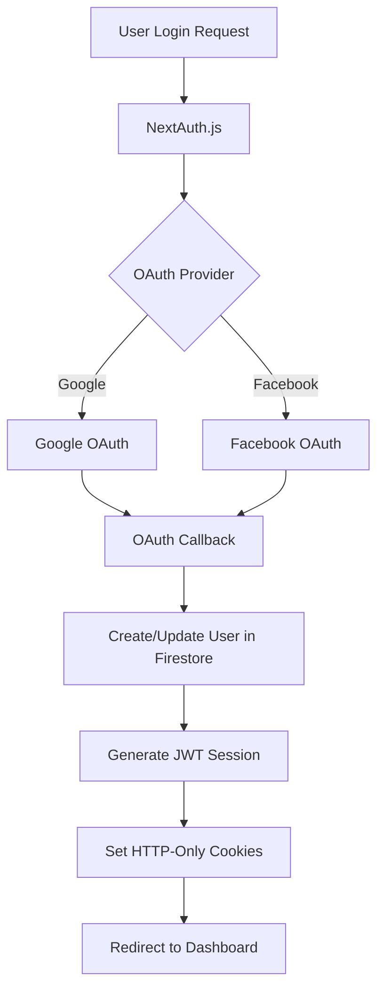
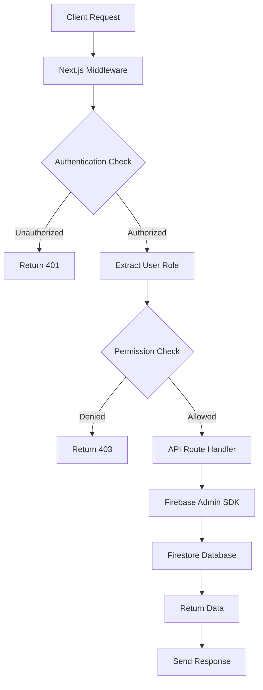
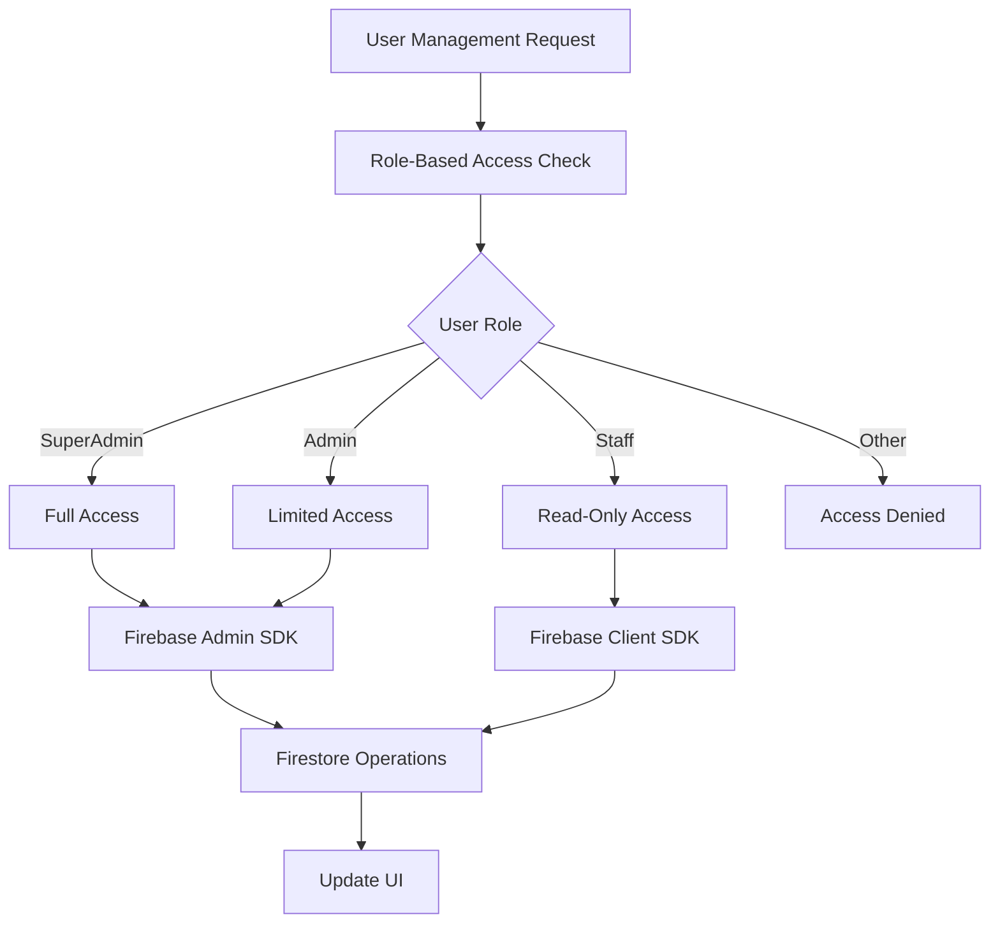
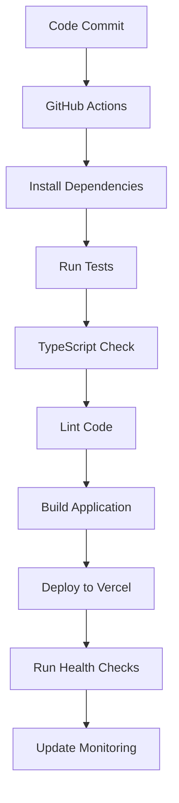

# 🏗️ System Architecture Overview

## Platform Architecture

### High-Level Architecture
```
┌─────────────────────────────────────────────────────────────┐
│                    Client Layer (Frontend)                  │
├─────────────────────────────────────────────────────────────┤
│  Next.js 15.5.2 App Router │ React 18 │ TypeScript │ Tailwind CSS │
├─────────────────────────────────────────────────────────────┤
│                  Authentication Layer                       │
├─────────────────────────────────────────────────────────────┤
│        NextAuth.js │ Google OAuth │ Facebook OAuth          │
├─────────────────────────────────────────────────────────────┤
│                     API Layer                              │
├─────────────────────────────────────────────────────────────┤
│           Next.js API Routes │ Server Components            │
├─────────────────────────────────────────────────────────────┤
│                   Business Logic Layer                      │
├─────────────────────────────────────────────────────────────┤
│    User Management │ RBAC │ Content Management │ Analytics   │
├─────────────────────────────────────────────────────────────┤
│                     Data Layer                             │
├─────────────────────────────────────────────────────────────┤
│           Firebase Firestore │ Firebase Admin SDK           │
├─────────────────────────────────────────────────────────────┤
│                  Infrastructure Layer                       │
├─────────────────────────────────────────────────────────────┤
│              Vercel │ Firebase Hosting │ CDN                │
└─────────────────────────────────────────────────────────────┘
```

## Core Technologies

### Frontend Architecture
```typescript
// Technology Stack
const frontendStack = {
  framework: 'Next.js 15.5.2',
  runtime: 'React 18',
  language: 'TypeScript 5.2.2',
  styling: 'Tailwind CSS 3.4.15',
  components: 'Radix UI + Custom Components',
  state: 'React Hooks + Context API',
  routing: 'Next.js App Router',
  bundler: 'Next.js Webpack'
}
```

### Backend Architecture
```typescript
// Backend Stack
const backendStack = {
  api: 'Next.js API Routes',
  serverComponents: 'React Server Components',
  authentication: 'NextAuth.js 4.24.11',
  database: 'Firebase Firestore',
  serverSdk: 'Firebase Admin SDK 13.5.0',
  security: 'Firebase Security Rules',
  validation: 'Zod 3.23.8'
}
```

## Application Structure

### Directory Organization
```
platform/
├── app/                          # Next.js App Router
│   ├── (protected)/             # Protected route group
│   ├── admin/                   # Admin dashboard
│   ├── api/                     # API endpoints
│   │   ├── auth/               # Authentication endpoints
│   │   ├── users/              # User management API
│   │   ├── database/           # Database operations
│   │   └── health/             # Health check endpoints
│   ├── auth/                   # Authentication pages
│   ├── user-management/        # User management pages
│   ├── database-init/          # Database initialization
│   ├── globals.css            # Global styles
│   ├── layout.tsx             # Root layout
│   ├── page.tsx               # Home page
│   └── loading.tsx            # Loading component
├── components/                 # Reusable components
│   ├── layout/                # Layout components
│   ├── providers/             # Context providers
│   ├── ui/                    # UI component library
│   └── user-management/       # Feature-specific components
├── lib/                       # Utility libraries
│   ├── firebase-admin.ts      # Firebase Admin SDK
│   ├── firebase.ts           # Firebase client SDK
│   ├── auth.ts               # Authentication utilities
│   └── utils.ts              # General utilities
├── hooks/                     # Custom React hooks
├── docs/                      # Documentation
├── public/                    # Static assets
├── scripts/                   # Build and deployment scripts
└── middleware.ts              # Next.js middleware
```

### Component Architecture
```typescript
// Component Hierarchy
interface ComponentArchitecture {
  layout: {
    RootLayout: 'Global layout with providers'
    Sidebar: 'Navigation sidebar'
    Header: 'Application header'
    Footer: 'Application footer'
  }
  
  pages: {
    Dashboard: 'Main dashboard page'
    UserManagement: 'User management interface'
    Profile: 'User profile management'
    Settings: 'Application settings'
  }
  
  features: {
    UserTable: 'User data display'
    UserForm: 'User creation/editing'
    RoleSelector: 'Role selection component'
    PermissionGuard: 'Access control wrapper'
  }
  
  ui: {
    Button: 'Reusable button component'
    Input: 'Form input component'
    Modal: 'Modal dialog component'
    Card: 'Content card component'
  }
}
```

## Data Flow Architecture

### Authentication Flow


### API Request Flow


### User Management Flow


## Security Architecture

### Multi-Layer Security
```typescript
// Security Layers
const securityLayers = {
  client: {
    authentication: 'NextAuth.js session management',
    authorization: 'Role-based component rendering',
    validation: 'Client-side form validation',
    sanitization: 'XSS prevention'
  },
  
  middleware: {
    authentication: 'JWT token validation',
    authorization: 'Route-level permission checks',
    rateLimit: 'Request throttling',
    cors: 'Cross-origin request handling'
  },
  
  api: {
    authentication: 'Server session validation',
    authorization: 'Endpoint permission checks',
    validation: 'Input validation with Zod',
    sanitization: 'Data sanitization'
  },
  
  database: {
    rules: 'Firestore security rules',
    encryption: 'Data encryption at rest',
    backup: 'Automated backups',
    monitoring: 'Access logging'
  }
}
```

### Role-Based Access Control
```typescript
// RBAC Architecture
interface RBACArchitecture {
  roles: {
    SuperAdmin: {
      permissions: ['*']
      scope: 'global'
    }
    Admin: {
      permissions: ['user.manage', 'content.manage', 'analytics.view']
      scope: 'organization'
    }
    Staff: {
      permissions: ['user.support', 'content.create', 'reports.view']
      scope: 'department'
    }
    Partner: {
      permissions: ['partner.data', 'communication.internal']
      scope: 'partner'
    }
    Agent: {
      permissions: ['sales.view', 'commission.view', 'territory.access']
      scope: 'territory'
    }
    User: {
      permissions: ['profile.manage', 'service.request']
      scope: 'personal'
    }
  }
}
```

## Database Architecture

### Firestore Collections Structure
```typescript
// Database Schema
interface DatabaseSchema {
  users: {
    id: string
    name: string
    email: string
    role: 'SuperAdmin' | 'Admin' | 'Staff' | 'Partner' | 'Agent' | 'User'
    category: string
    subcategory: string
    status: 'Active' | 'Inactive' | 'Suspended'
    permissions: string[]
    createdAt: Date
    updatedAt: Date
    lastLogin?: Date
  }
  
  content: {
    id: string
    title: string
    content: string
    type: string
    status: 'draft' | 'published' | 'archived'
    author: string
    createdAt: Date
    updatedAt: Date
  }
  
  analytics: {
    id: string
    metric: string
    value: number
    timestamp: Date
    metadata: Record<string, any>
  }
  
  settings: {
    id: string
    category: string
    settings: Record<string, any>
    updatedAt: Date
  }
  
  audit_logs: {
    id: string
    userId: string
    action: string
    resource: string
    timestamp: Date
    details: Record<string, any>
  }
}
```

### Database Security Rules
```javascript
// Firestore Security Rules Architecture
rules_version = '2';
service cloud.firestore {
  match /databases/{database}/documents {
    // User-based access control
    function isAuthenticated() {
      return request.auth != null;
    }
    
    function getUserRole() {
      return get(/databases/$(database)/documents/users/$(request.auth.uid)).data.role;
    }
    
    function hasRole(role) {
      return getUserRole() == role;
    }
    
    function hasAnyRole(roles) {
      return getUserRole() in roles;
    }
    
    // Collection-specific rules
    match /users/{userId} {
      allow read: if isAuthenticated() && 
        (request.auth.uid == userId || hasAnyRole(['SuperAdmin', 'Admin', 'Staff']));
      allow write: if isAuthenticated() && 
        hasAnyRole(['SuperAdmin', 'Admin']);
    }
    
    match /content/{contentId} {
      allow read: if isAuthenticated();
      allow write: if isAuthenticated() && 
        hasAnyRole(['SuperAdmin', 'Admin', 'Staff']);
    }
  }
}
```

## Performance Architecture

### Optimization Strategies
```typescript
// Performance Optimizations
const performanceStrategy = {
  frontend: {
    codesplitting: 'Dynamic imports for route-based splitting',
    lazyLoading: 'Lazy load heavy components',
    imageOptimization: 'Next.js Image component with optimization',
    bundleOptimization: 'Tree shaking and dead code elimination'
  },
  
  api: {
    caching: 'Response caching with proper headers',
    pagination: 'Cursor-based pagination for large datasets',
    compression: 'Gzip compression enabled',
    rateLimit: 'Request rate limiting'
  },
  
  database: {
    indexing: 'Proper Firestore indexes',
    queryOptimization: 'Efficient query patterns',
    caching: 'Client-side query caching',
    batchOperations: 'Batch reads and writes'
  },
  
  infrastructure: {
    cdn: 'Vercel Edge Network',
    serverless: 'Automatic scaling with Vercel Functions',
    monitoring: 'Performance monitoring and alerts',
    optimization: 'Edge runtime optimization'
  }
}
```

### Caching Strategy
```typescript
// Caching Architecture
interface CachingStrategy {
  client: {
    sessionStorage: 'User session data'
    localStorage: 'User preferences'
    reactQuery: 'API response caching'
    serviceWorker: 'Offline functionality'
  }
  
  server: {
    apiRoutes: 'Response caching with headers'
    staticGeneration: 'Static page generation'
    isr: 'Incremental Static Regeneration'
    edgeCache: 'Vercel Edge caching'
  }
  
  database: {
    firestore: 'Built-in caching'
    adminSdk: 'Connection pooling'
    queries: 'Query result caching'
    realtime: 'Real-time listener optimization'
  }
}
```

## Deployment Architecture

### CI/CD Pipeline


### Environment Strategy
```typescript
// Environment Configuration
interface EnvironmentStrategy {
  development: {
    database: 'Firebase development project'
    auth: 'Development OAuth credentials'
    monitoring: 'Local logging'
    features: 'All features enabled'
  }
  
  staging: {
    database: 'Firebase staging project'
    auth: 'Staging OAuth credentials'
    monitoring: 'Basic monitoring'
    features: 'Production features'
  }
  
  production: {
    database: 'Firebase production project'
    auth: 'Production OAuth credentials'
    monitoring: 'Full monitoring and alerts'
    features: 'Optimized features'
  }
}
```

## Monitoring and Observability

### Monitoring Stack
```typescript
// Monitoring Architecture
const monitoringStack = {
  performance: {
    frontend: 'Vercel Analytics + Core Web Vitals'
    api: 'Function performance metrics'
    database: 'Firebase Performance Monitoring'
    infrastructure: 'Vercel monitoring dashboard'
  }
  
  logging: {
    application: 'Console logging with levels'
    api: 'Request/response logging'
    errors: 'Error tracking and reporting'
    audit: 'User action audit logs'
  }
  
  alerting: {
    uptime: 'Uptime monitoring'
    errors: 'Error rate thresholds'
    performance: 'Performance degradation alerts'
    security: 'Security incident alerts'
  }
  
  analytics: {
    usage: 'User behavior analytics'
    performance: 'Application performance metrics'
    business: 'Business KPI tracking'
    technical: 'Technical metric dashboards'
  }
}
```

## Scalability Considerations

### Horizontal Scaling
- **Serverless Functions**: Automatic scaling with Vercel
- **Database Scaling**: Firestore automatic scaling
- **CDN Distribution**: Global edge network
- **Load Balancing**: Automatic traffic distribution

### Vertical Optimization
- **Code Splitting**: Reduce bundle sizes
- **Lazy Loading**: Load components on demand
- **Database Optimization**: Efficient queries and indexes
- **Caching Strategy**: Multi-layer caching

### Future Scalability
- **Microservices**: Potential service decomposition
- **Database Sharding**: Horizontal database scaling
- **Multi-Region**: Global deployment strategy
- **Performance Monitoring**: Continuous optimization

---

**Last Updated**: January 2025
**Version**: 1.0.0
**Architecture Status**: Production Ready ✅